# Blob Game Architecture Diagrams

LAST UPDATED: JULY 8th

## Class Diagram

```mermaid
classDiagram
    %% Core Game Engine
    class GameState {
        +blobs: BlobState[]
        +biomass: number
        +growth: number
        +clickPower: number
        +generators: Record~string, GeneratorState~
        +upgrades: Record~string, UpgradeState~
        +nutrients: NutrientState[]
        +currentLevelId: number
        +highestLevelReached: number
    }

    class BlobState {
        +size: number
    }

    class NutrientState {
        +id: string
        +x: number
        +y: number
        +consumed: boolean
    }

    class GeneratorState {
        +id: string
        +name: string
        +baseCost: number
        +description: string
        +baseEffect: number
        +level: number
        +costMultiplier: number
        +unlockedAtLevel: string
    }

    class UpgradeState {
        +id: string
        +name: string
        +cost: number
        +description: string
        +effect: number
        +type: 'growth' | 'split' | 'click' | 'blob'
        +purchased: boolean
        +unlockedAtLevel: string
    }

    class Level {
        +id: number
        +name: string
        +displayName: string
        +biomassThreshold: number
        +biomassDisplayFormat: 'standard' | 'scientific' | 'decimal' | 'whole'
        +background: string
        +foodTypes: string[]
        +description: string
    }

    class Cell {
        +x: number
        +y: number
        +status: CellStatus
    }

    class MapState {
        +currentLevel: Level
        +size: number
        +cells: Cell[]
        +get(x, y): CellStatus
        +set(x, y, status): void
        +setLevel(level): void
        +evolveToNextLevel(biomass): void
    }

    %% React Components
    class GameHUD {
        +biomass: number
        +gameState: GameState
        +onBuyGenerator(generatorId): void
        +onBuyUpgrade(upgradeId): void
        +onEvolve(): void
        +blobSize: number
    }

    class Shop {
        +biomass: number
        +gameState: GameState
        +onBuyGenerator(generatorId): void
        +onBuyUpgrade(upgradeId): void
        -generatorFilter: 'current' | 'all'
    }

    class GrowthStats {
        +biomass: number
        +gameState: GameState
    }

    class EvolutionPanel {
        +biomass: number
        +gameState: GameState
        +onEvolve(): void
    }

    class Blob {
        +id: string
        +position: {x, y}
        +size: number
        +biomass: number
        +onBlobClick(): void
        +onBlobPress(): void
        +onBlobRelease(): void
        +color: string
        +strokeColor: string
        +glowColor: string
        +isDisabled: boolean
        +isActive: boolean
        +clickPower: number
    }

    class Map {
        +className: string
    }

    class AnimationLayer {
        -floatingNumbers: FloatingNumberAnimation[]
        -particles: ParticleData[]
        +addFloatingNumber(position, value, color): void
        +addParticleBurst(position, count, colors): void
    }

    %% Hooks
    class useGame {
        +gameState: GameState
        +buyGenerator(generatorId): void
        +buyUpgrade(upgradeId): void
        +manualClick(): void
        +evolve(): void
    }

    class useBlobSize {
        +calculateBlobSize(biomass): number
    }

    class useCameraZoom {
        +calculateZoom(biomass): number
    }

    %% Relationships
    GameState ||--o{ BlobState : contains
    GameState ||--o{ NutrientState : contains
    GameState ||--o{ GeneratorState : contains
    GameState ||--o{ UpgradeState : contains
    GameState ||--|| Level : current
    MapState ||--o{ Cell : contains
    MapState ||--|| Level : current

    GameHUD ||--|| Shop : contains
    GameHUD ||--|| GrowthStats : contains
    GameHUD ||--|| EvolutionPanel : contains
    GameHUD ||--|| ScaleIndicator : contains

    useGame ||--|| GameState : manages
    useBlobSize ||--|| GameState : reads
    useCameraZoom ||--|| GameState : reads

    Map ||--o{ Blob : renders
    AnimationLayer ||--o{ FloatingNumber : manages
    AnimationLayer ||--o{ Particle : manages
```

## Sequence Diagrams

### User Flow: Manual Click and Growth

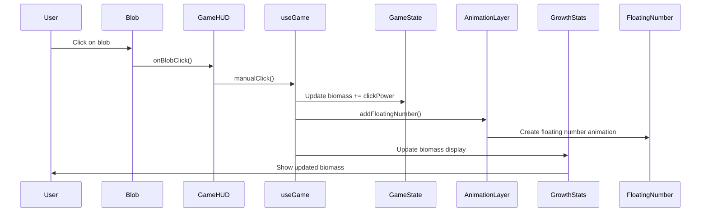

### User Flow: Purchase Generator

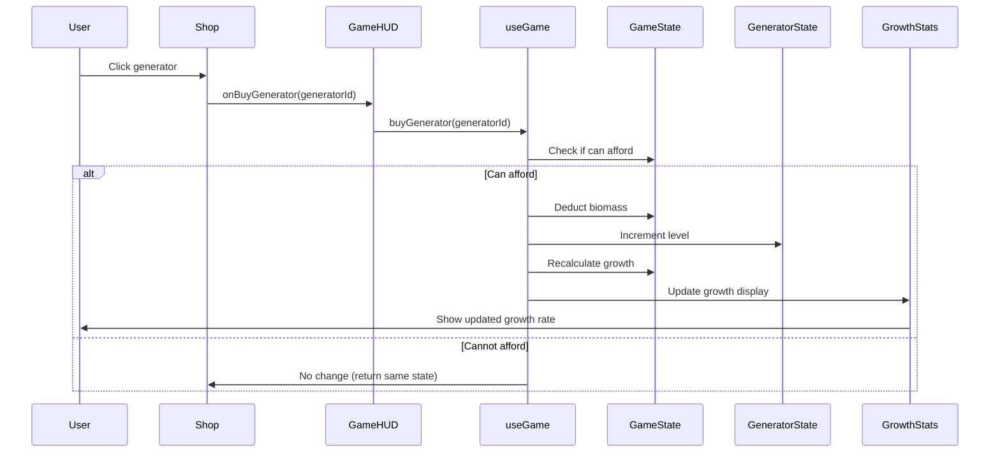

### User Flow: Level Evolution

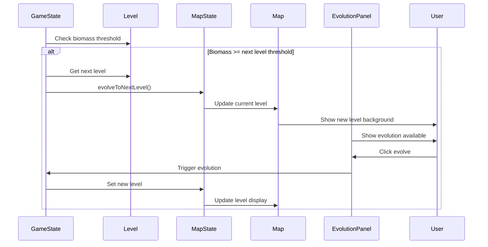

### User Flow: Nutrient Consumption

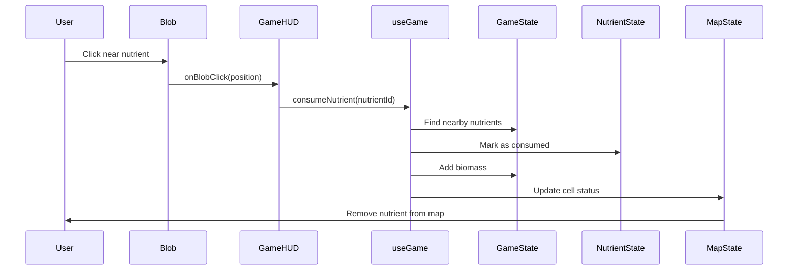

## State Diagrams

### Game Level Progression

```mermaid
stateDiagram-v2
    [*] --> Intro
    Intro --> Microscopic : biomass >= 1
    Microscopic --> PetriDish : biomass >= 2500
    PetriDish --> Lab : biomass >= 2,250,000
    Lab --> City : biomass >= 800,000,000
    City --> Earth : biomass >= 300,000,000,000
    Earth --> SolarSystem : biomass >= 100,000,000,000,000
    SolarSystem --> [*] : Max level reached

    state Intro {
        [*] --> BasicGenerator
        BasicGenerator --> ClickPowerUpgrade
    }

    state Microscopic {
        [*] --> MicroscopicCloner
        MicroscopicCloner --> CellDivider
        CellDivider --> NucleusReplicator
    }

    state PetriDish {
        [*] --> ColonyExpander
        ColonyExpander --> SporeLauncher
        SporeLauncher --> ContaminantConverter
    }

    state Lab {
        [*] --> CentrifugeSorter
        CentrifugeSorter --> BioreactorTank
        BioreactorTank --> AutoclaveRecycler
    }

    state City {
        [*] --> HumanoidSlimes
        HumanoidSlimes --> SewerColonies
        SewerColonies --> SubwaySpreaders
    }

    state Earth {
        [*] --> CargoShipInfestors
        CargoShipInfestors --> AirplaneSporeUnits
        AirplaneSporeUnits --> ForestHiveColonies
    }

    state SolarSystem {
        [*] --> TerraformingOoze
        TerraformingOoze --> AsteroidSeeder
        AsteroidSeeder --> StarshipIncubator
    }
```

### Generator Purchase State

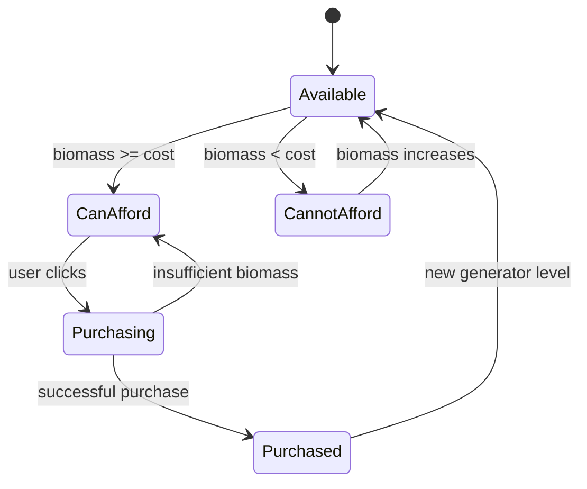

### Upgrade Purchase State

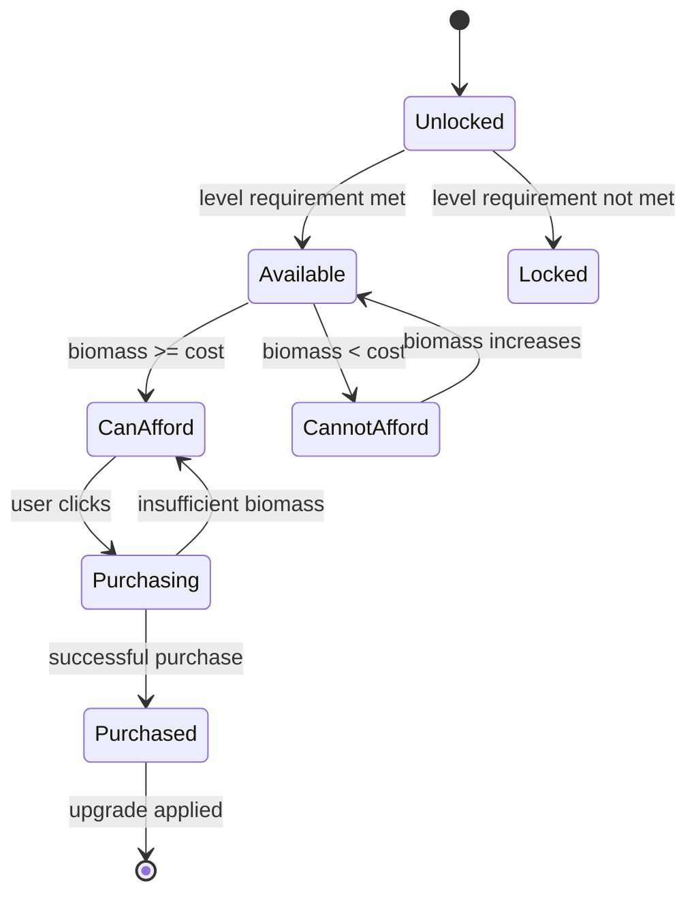

### Blob Animation State

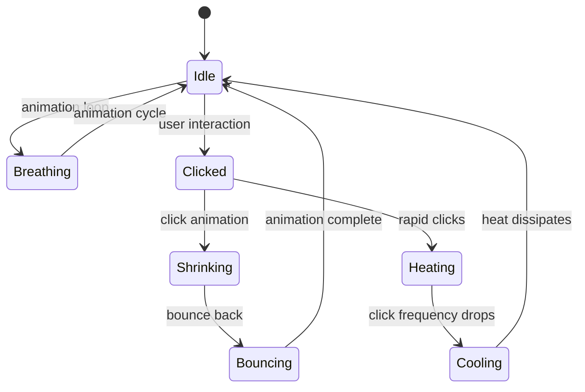

### Game Session State

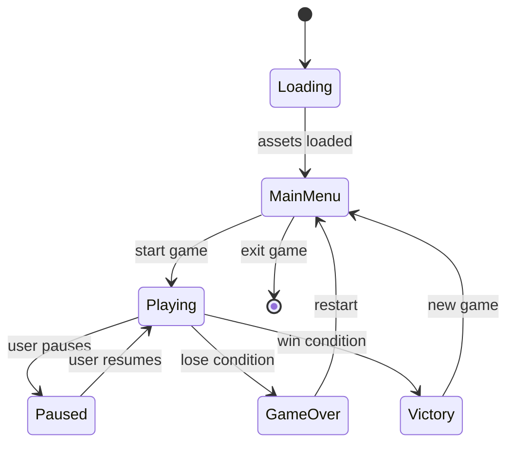

## Component Architecture

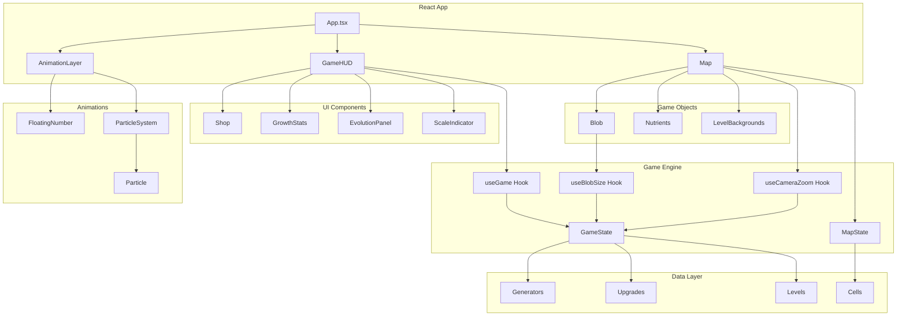

## Data Flow Architecture

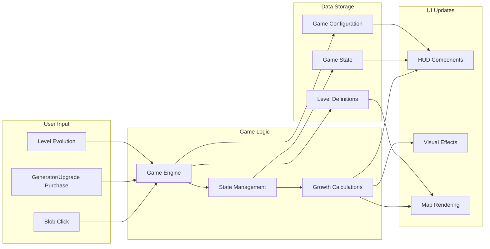

This comprehensive architecture documentation shows the relationships between all major components, user flows, state transitions, and data flow patterns in the blob game.
