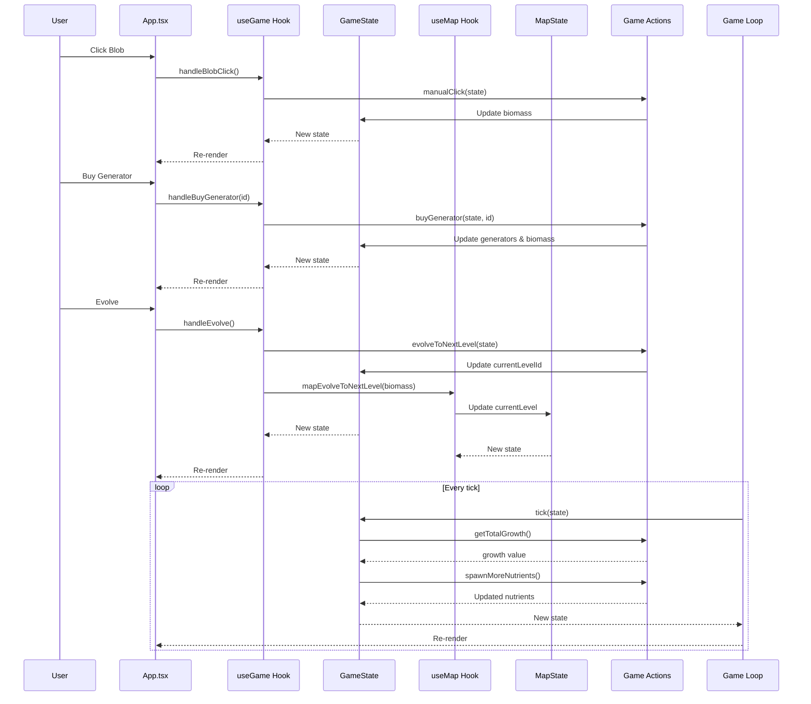
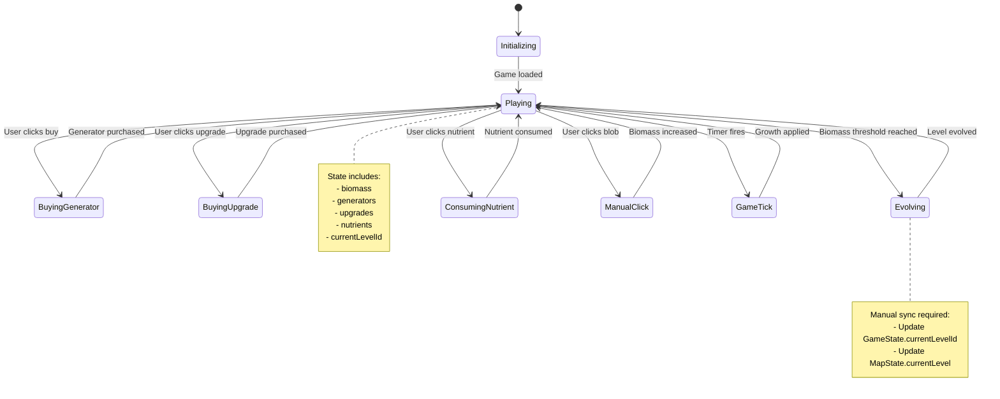
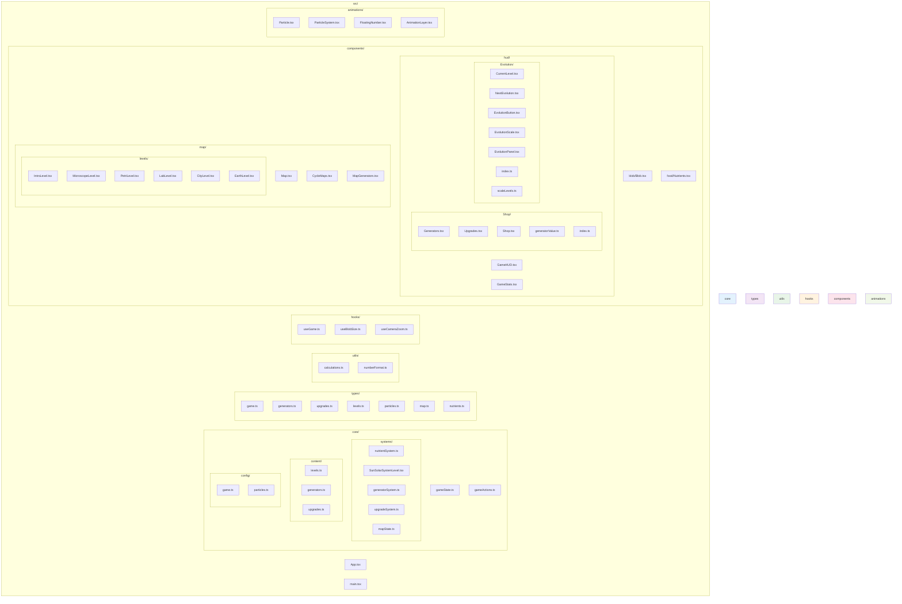
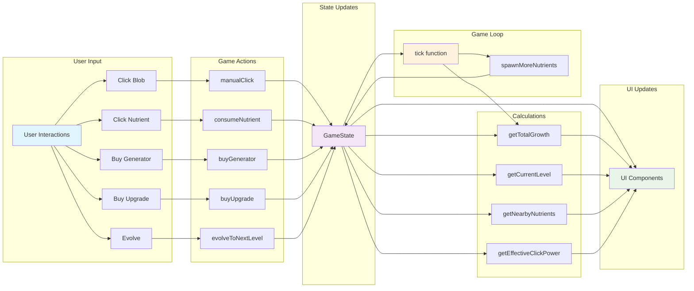
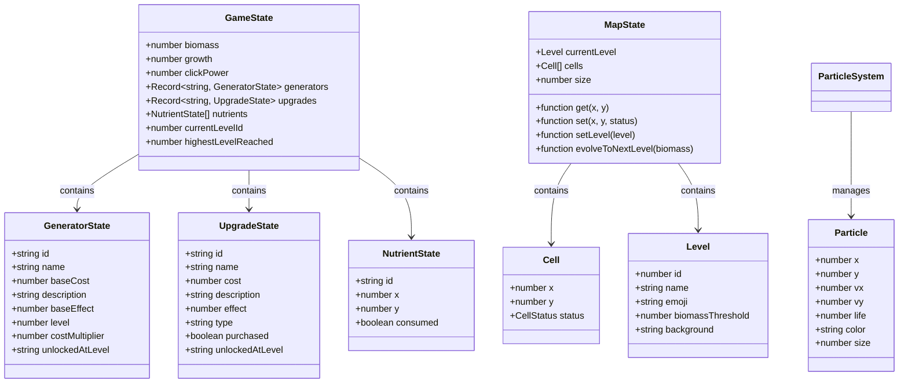
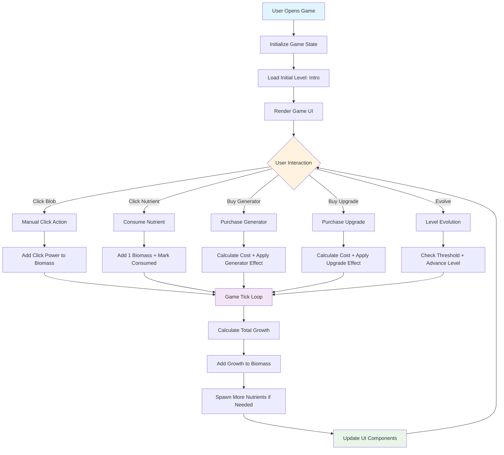

# Architecture Diagrams

## State Management Flow

```mermaid
flowchart TD
    subgraph "React State (useGame Hook)"
        GS[GameState]
        GS --> B[biomass: number]
        GS --> G[growth: number]
        GS --> CP[clickPower: number]
        GS --> GEN[generators: Record<string, GeneratorState>]
        GS --> UP[upgrades: Record<string, UpgradeState>]
        GS --> N[nutrients: NutrientState[]]
        GS --> CL[currentLevelId: number]
        GS --> HL[highestLevelReached: number]
    end

    subgraph "Zustand State (useMap Hook)"
        MS[MapState]
        MS --> ML[currentLevel: Level]
        MS --> MC[cells: Cell[]]
        MS --> MSIZE[size: number]
        MS --> MGET[get: function]
        MS --> MSET[set: function]
        MS --> MSL[setLevel: function]
        MS --> MEL[evolveToNextLevel: function]
    end

    subgraph "State Management Problems"
        subgraph "Dual State Management"
            US[useGame Hook]
            UM[useMap Hook]

            US --> GS
            UM --> MS

            %% Problem: Tight coupling
            US -.->|"mapEvolveToNextLevel()"| UM
            US -.->|"evolveToNextLevel()"| UM
        end

        subgraph "State Synchronization Issues"
            SYNC1["Level info in GameState.currentLevelId"]
            SYNC2["Level info in MapState.currentLevel"]
            SYNC1 -.->|"Can get out of sync"| SYNC2

            SYNC3["Biomass in GameState"]
            SYNC4["Map evolution based on biomass"]
            SYNC3 -.->|"Manual sync required"| SYNC4
        end

        subgraph "Performance Issues"
            PERF1["Every tick updates entire GameState"]
            PERF2["Large cell array in MapState"]
            PERF3["No memoization of calculations"]
            PERF4["Unnecessary re-renders"]
        end
    end

    subgraph "Game Actions"
        ACT --> MC[manualClick]
        ACT --> CN[consumeNutrient]
        ACT --> BG[buyGenerator]
        ACT --> BU[buyUpgrade]
        ACT --> EL[evolveToNextLevel]
    end

    subgraph "Game Loop"
        GL --> TICK[tick function]
        TICK --> TG[getTotalGrowth]
        TICK --> SMN[spawnMoreNutrients]
    end

    %% Connections showing the problems
    GS --> ACT
    GS --> GL
    MS -.->|"Tight coupling"| ACT
    MS -.->|"Manual sync"| GL

    style GS fill:#e3f2fd
    style MS fill:#ffebee
    style US fill:#f3e5f5
    style UM fill:#fff3e0
    style SYNC1 fill:#ffcdd2
    style SYNC2 fill:#ffcdd2
    style PERF1 fill:#ffcdd2
    style PERF2 fill:#ffcdd2
```

## User Interaction Sequence



## Game State Transitions



## Component Architecture

```mermaid
flowchart TD
    subgraph "App.tsx"
        APP[App Component]
        APP --> BL[Blob Component]
        APP --> NU[Nutrients Component]
        APP --> GH[GameHUD Component]
        APP --> MG[MapGenerators Component]
        APP --> MAP[Map Component]
        APP --> PS[ParticleSystem Component]
        APP --> AL[AnimationLayer Component]
    end

    subgraph "Game HUD"
        GH --> GS[GameStats Component]
        GH --> SH[Shop Component]
        GH --> EP[EvolutionPanel Component]

        SH --> SG[Generators Component]
        SH --> SU[Upgrades Component]

        EP --> CL[CurrentLevel Component]
        EP --> NE[NextEvolution Component]
        EP --> EB[EvolutionButton Component]
        EP --> ES[EvolutionScale Component]
    end

    subgraph "Map System"
        MAP --> CM[CycleMaps Component]
        MAP --> IL[IntroLevel Component]
        MAP --> ML[MicroscopeLevel Component]
        MAP --> PL[PetriLevel Component]
        MAP --> LL[LabLevel Component]
        MAP --> CIL[CityLevel Component]
        MAP --> EL[EarthLevel Component]
        MAP --> SSL[SunSolarSystemLevel Component]
    end

    subgraph "Animations"
        AL --> FN[FloatingNumber Component]
        AL --> P[Particle Component]
        PS --> P
    end

    style APP fill:#e1f5fe
    style GH fill:#f3e5f5
    style MAP fill:#e8f5e8
    style AL fill:#fff3e0
```



## File Architecture



## Data Flow Architecture



## Class Diagram



## User Flow Diagram



## Proposed Unified State Architecture

```mermaid
flowchart TD
    subgraph "Unified State Management"
        subgraph "Single Source of Truth"
            US[useGameStore Hook]
            US --> GS[GameState]
            GS --> B[biomass: number]
            GS --> G[growth: number]
            GS --> CP[clickPower: number]
            GS --> GEN[generators: Record<string, GeneratorState>]
            GS --> UP[upgrades: Record<string, UpgradeState>]
            GS --> N[nutrients: NutrientState[]]
            GS --> CL[currentLevel: Level]
            GS --> HL[highestLevelReached: number]
            GS --> MC[cells: Cell[]]
        end

        subgraph "Centralized Actions"
            ACT[Game Actions]
            ACT --> MC[manualClick]
            ACT --> CN[consumeNutrient]
            ACT --> BG[buyGenerator]
            ACT --> BU[buyUpgrade]
            ACT --> EL[evolveToNextLevel]
            ACT --> SMN[spawnMoreNutrients]
        end

        subgraph "Optimized Game Loop"
            GL[Game Loop]
            GL --> TICK[tick function]
            TICK --> TG[getTotalGrowth]
            TICK --> SMN
        end
    end

    subgraph "Benefits"
        BEN1["Single state source"]
        BEN2["No synchronization issues"]
        BEN3["Consistent update patterns"]
        BEN4["Better performance"]
        BEN5["Easier testing"]
    end

    GS --> ACT
    GS --> GL
    ACT --> GS
    GL --> GS

    style GS fill:#e8f5e8
    style US fill:#e3f2fd
    style ACT fill:#f3e5f5
    style GL fill:#fff3e0
    style BEN1 fill:#c8e6c9
    style BEN2 fill:#c8e6c9
    style BEN3 fill:#c8e6c9
    style BEN4 fill:#c8e6c9
    style BEN5 fill:#c8e6c9
```
