# Blob Game Architecture Diagrams

## Class Diagram

```mermaid
classDiagram
    %% Core Game Engine
    class GameState {
        +blobs: BlobState[]
        +biomass: number
        +growth: number
        +clickPower: number
        +generators: Record~string, GeneratorState~
        +upgrades: Record~string, UpgradeState~
        +nutrients: NutrientState[]
        +currentLevelId: number
        +highestLevelReached: number
    }

    class BlobState {
        +size: number
    }

    class NutrientState {
        +id: string
        +x: number
        +y: number
        +consumed: boolean
    }

    class GeneratorState {
        +id: string
        +name: string
        +baseCost: number
        +description: string
        +baseEffect: number
        +level: number
        +costMultiplier: number
        +unlockedAtLevel: string
    }

    class UpgradeState {
        +id: string
        +name: string
        +cost: number
        +description: string
        +effect: number
        +type: 'growth' | 'split' | 'click' | 'blob'
        +purchased: boolean
        +unlockedAtLevel: string
    }

    class Level {
        +id: number
        +name: string
        +displayName: string
        +biomassThreshold: number
        +biomassDisplayFormat: 'standard' | 'scientific' | 'decimal' | 'whole'
        +background: string
        +foodTypes: string[]
        +description: string
    }

    class Cell {
        +x: number
        +y: number
        +status: CellStatus
    }

    class MapState {
        +currentLevel: Level
        +size: number
        +cells: Cell[]
        +get(x, y): CellStatus
        +set(x, y, status): void
        +setLevel(level): void
        +evolveToNextLevel(biomass): void
    }

    %% React Components
    class GameHUD {
        +biomass: number
        +gameState: GameState
        +onBuyGenerator(generatorId): void
        +onBuyUpgrade(upgradeId): void
        +onEvolve(): void
        +blobSize: number
    }

    class Shop {
        +biomass: number
        +gameState: GameState
        +onBuyGenerator(generatorId): void
        +onBuyUpgrade(upgradeId): void
        -generatorFilter: 'current' | 'all'
    }

    class GameStats {
        +biomass: number
        +gameState: GameState
    }

    class EvolutionPanel {
        +biomass: number
        +gameState: GameState
        +onEvolve(): void
    }

    class EvolutionScale {
        +biomass: number
        +blobSize: number
        +scale: ScaleLevel
        +zoom: number
    }

    class CurrentLevel {
        +displayName: string
        +name: string
        +description: string
    }

    class NextEvolution {
        +nextLevel: Level
        +canEvolve: boolean
        +biomass: number
        +gameState: GameState
    }

    class EvolutionButton {
        +canEvolve: boolean
        +hasNextLevel: boolean
        +onEvolve(): void
    }

    class Generators {
        +biomass: number
        +gameState: GameState
        +onBuyGenerator(generatorId): void
        +generatorFilter: 'current' | 'all'
        +currentLevel: Level
    }

    class Upgrades {
        +biomass: number
        +gameState: GameState
        +onBuyUpgrade(upgradeId): void
        +generatorFilter: 'current' | 'all'
        +currentLevel: Level
    }

    class Blob {
        +id: string
        +position: {x, y}
        +size: number
        +biomass: number
        +onBlobClick(): void
        +onBlobPress(): void
        +onBlobRelease(): void
        +color: string
        +strokeColor: string
        +glowColor: string
        +isDisabled: boolean
        +isActive: boolean
        +clickPower: number
    }

    class Map {
        +className: string
    }

    class AnimationLayer {
        -floatingNumbers: FloatingNumberAnimation[]
        -particles: ParticleData[]
        +addFloatingNumber(position, value, color): void
        +addParticleBurst(position, count, colors): void
    }

    class ScaleLevel {
        +name: string
        +description: string
        +unit: string
        +color: string
        +icon: string
    }

    %% Hooks
    class useGame {
        +gameState: GameState
        +buyGenerator(generatorId): void
        +buyUpgrade(upgradeId): void
        +manualClick(): void
        +evolve(): void
    }

    class useBlobSize {
        +calculateBlobSize(biomass): number
    }

    class useCameraZoom {
        +calculateZoom(biomass): number
        +smoothZoomAnimation(): void
        +handleLevelReset(): void
    }

    class useMapSelector {
        +selectMapState(): MapState
    }

    %% Relationships
    GameState ||--o{ BlobState : contains
    GameState ||--o{ NutrientState : contains
    GameState ||--o{ GeneratorState : contains
    GameState ||--o{ UpgradeState : contains
    GameState ||--|| Level : current
    MapState ||--o{ Cell : contains
    MapState ||--|| Level : current

    GameHUD ||--|| Shop : contains
    GameHUD ||--|| GameStats : contains
    GameHUD ||--|| EvolutionPanel : contains

    Shop ||--|| Generators : contains
    Shop ||--|| Upgrades : contains

    EvolutionPanel ||--|| EvolutionScale : contains
    EvolutionPanel ||--|| CurrentLevel : contains
    EvolutionPanel ||--|| NextEvolution : contains
    EvolutionPanel ||--|| EvolutionButton : contains

    useGame ||--|| GameState : manages
    useBlobSize ||--|| GameState : reads
    useCameraZoom ||--|| GameState : reads
    useMapSelector ||--|| MapState : reads

    Map ||--o{ Blob : renders
    AnimationLayer ||--o{ FloatingNumber : manages
    AnimationLayer ||--o{ Particle : manages

    ScaleLevel ||--|| EvolutionScale : used by
```

## Sequence Diagrams

### User Flow: Manual Click and Growth

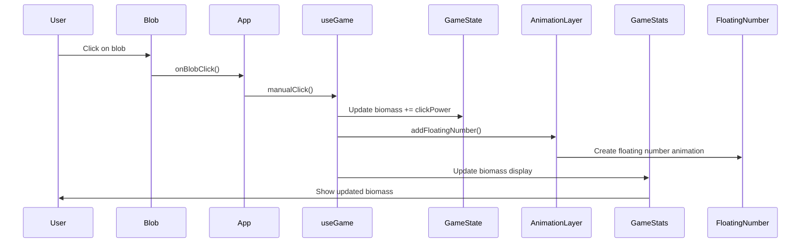

### User Flow: Purchase Generator

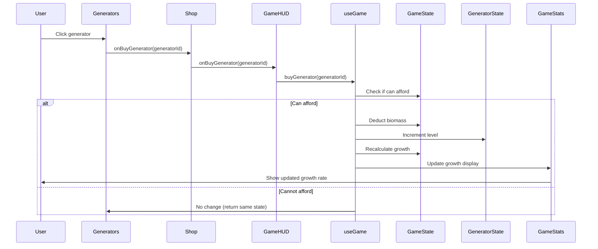

### User Flow: Level Evolution

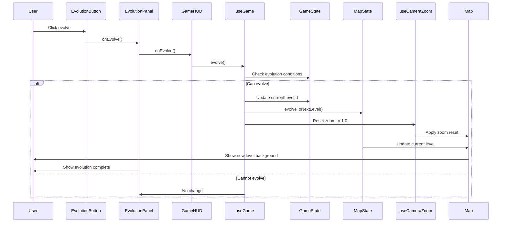

### User Flow: Camera Zoom with Blob Growth

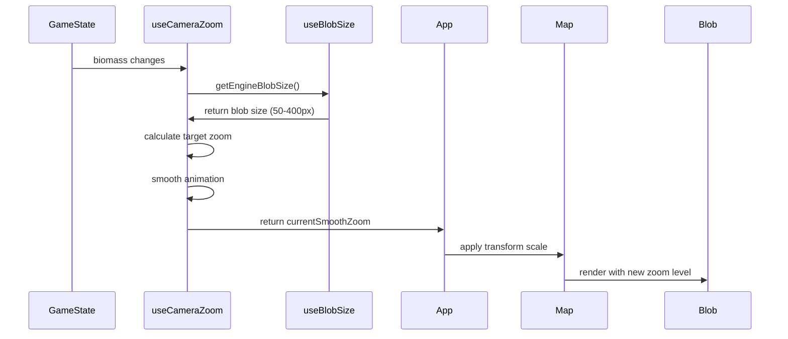

### User Flow: Nutrient Consumption

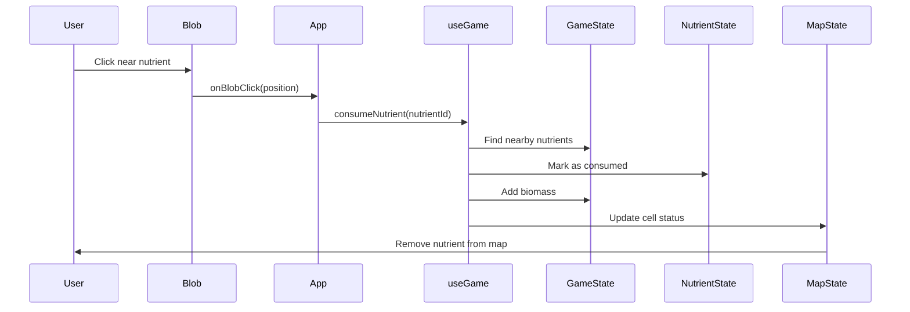

## State Diagrams

### Game Level Progression

```mermaid
stateDiagram-v2
    [*] --> Intro
    Intro --> Microscopic : biomass >= 1
    Microscopic --> PetriDish : biomass >= 2500
    PetriDish --> Lab : biomass >= 2,250,000
    Lab --> City : biomass >= 800,000,000
    City --> Earth : biomass >= 300,000,000,000
    Earth --> SolarSystem : biomass >= 100,000,000,000,000
    SolarSystem --> [*] : Max level reached

    state Intro {
        [*] --> BasicGenerator
        BasicGenerator --> ClickPowerUpgrade
    }

    state Microscopic {
        [*] --> MicroscopicCloner
        MicroscopicCloner --> CellDivider
        CellDivider --> NucleusReplicator
    }

    state PetriDish {
        [*] --> ColonyExpander
        ColonyExpander --> SporeLauncher
        SporeLauncher --> ContaminantConverter
    }

    state Lab {
        [*] --> CentrifugeSorter
        CentrifugeSorter --> BioreactorTank
        BioreactorTank --> AutoclaveRecycler
    }

    state City {
        [*] --> HumanoidSlimes
        HumanoidSlimes --> SewerColonies
        SewerColonies --> SubwaySpreaders
    }

    state Earth {
        [*] --> CargoShipInfestors
        CargoShipInfestors --> AirplaneSporeUnits
        AirplaneSporeUnits --> ForestHiveColonies
    }

    state SolarSystem {
        [*] --> TerraformingOoze
        TerraformingOoze --> AsteroidSeeder
        AsteroidSeeder --> StarshipIncubator
    }
```

### Camera Zoom State

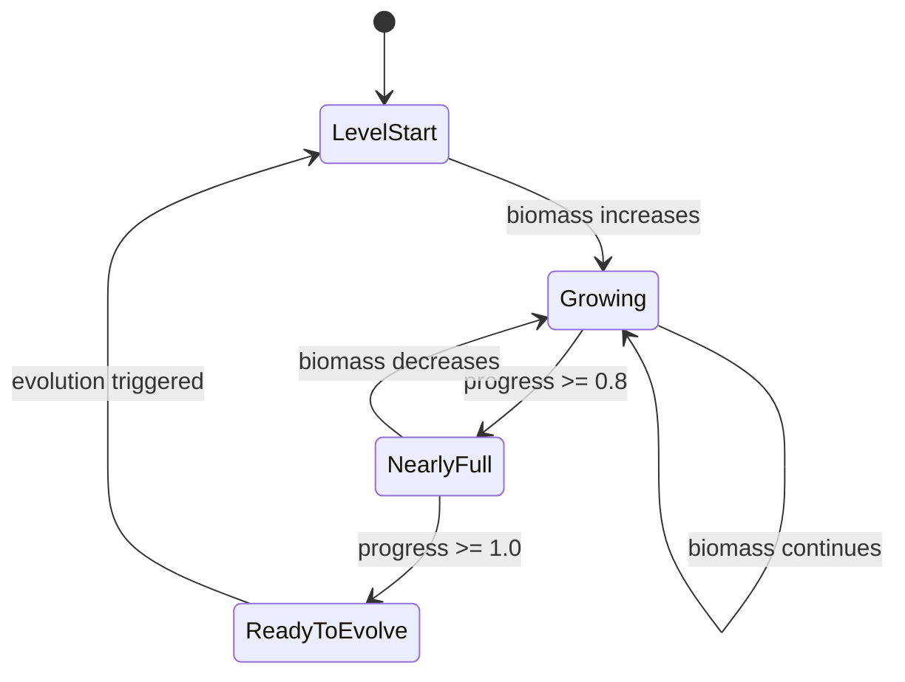

### Generator Purchase State

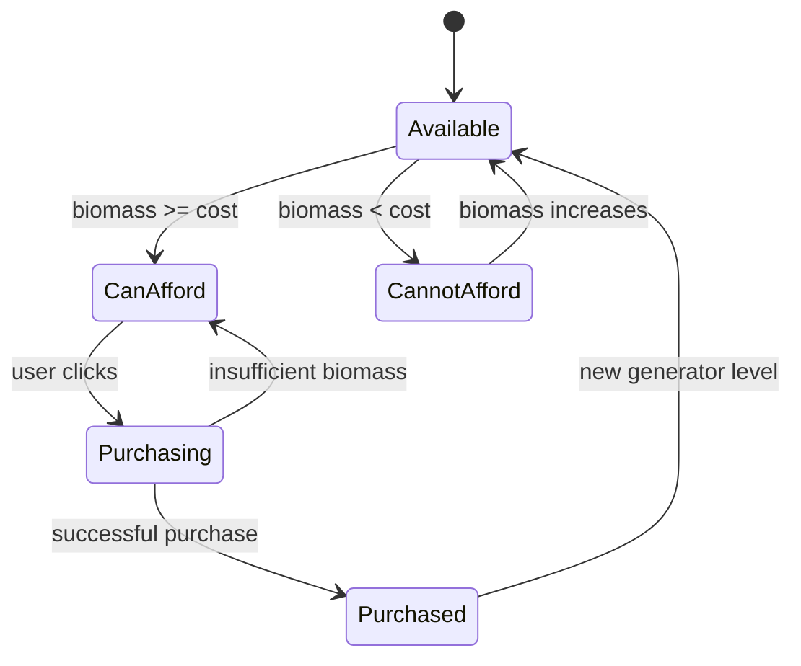

### Upgrade Purchase State

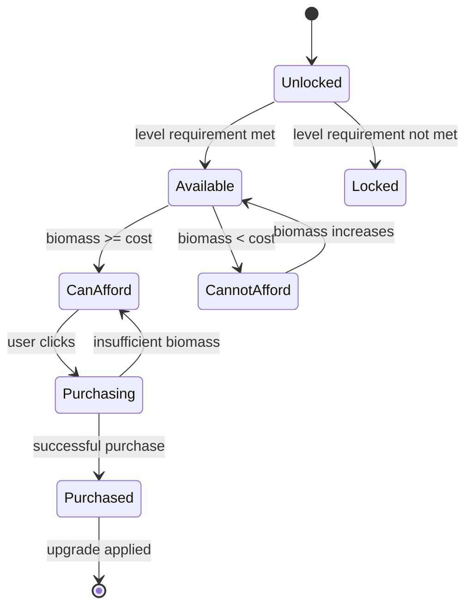

### Blob Animation State

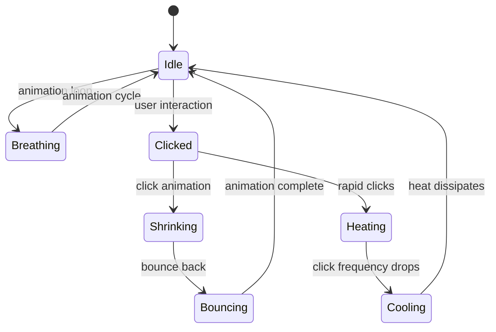

### Game Session State

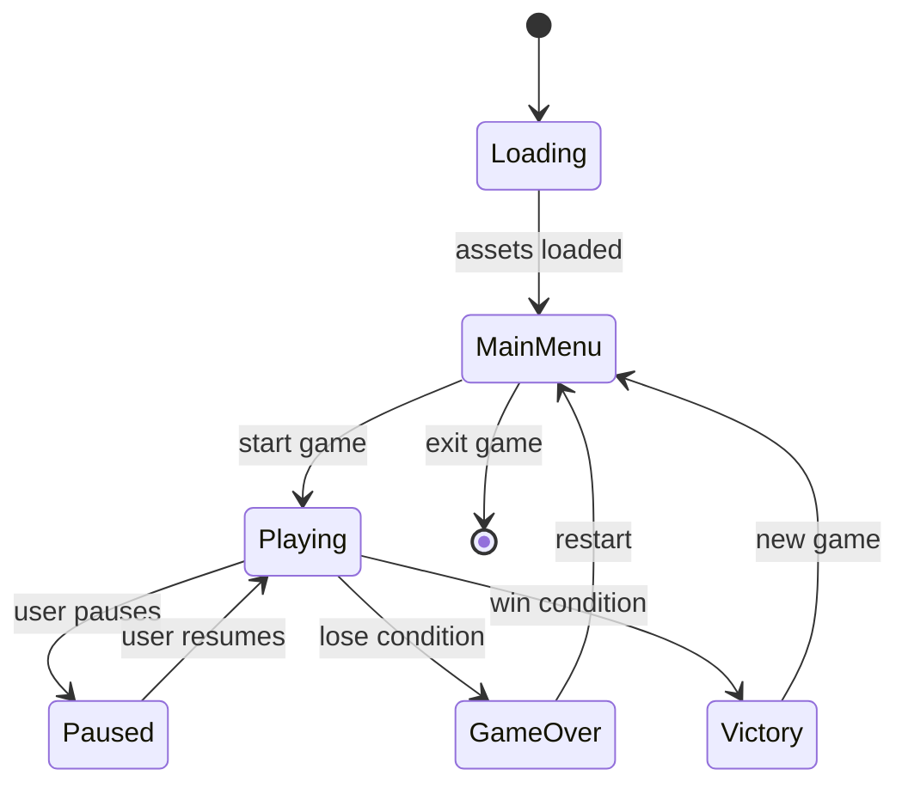

## Component Architecture

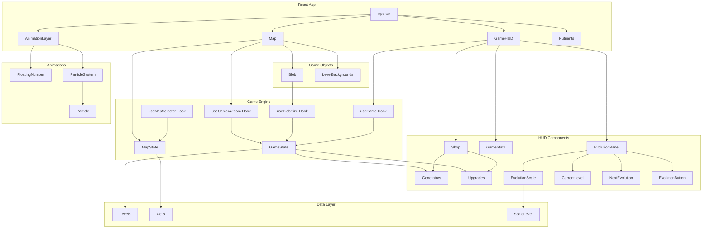

## HUD Layout Architecture

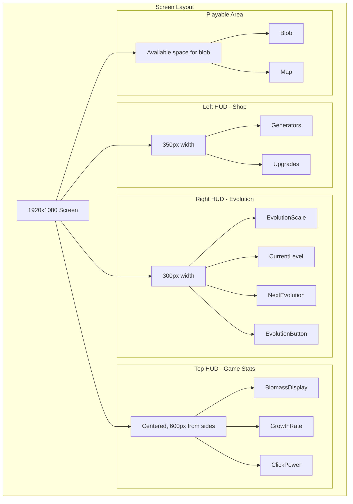

## Data Flow Architecture

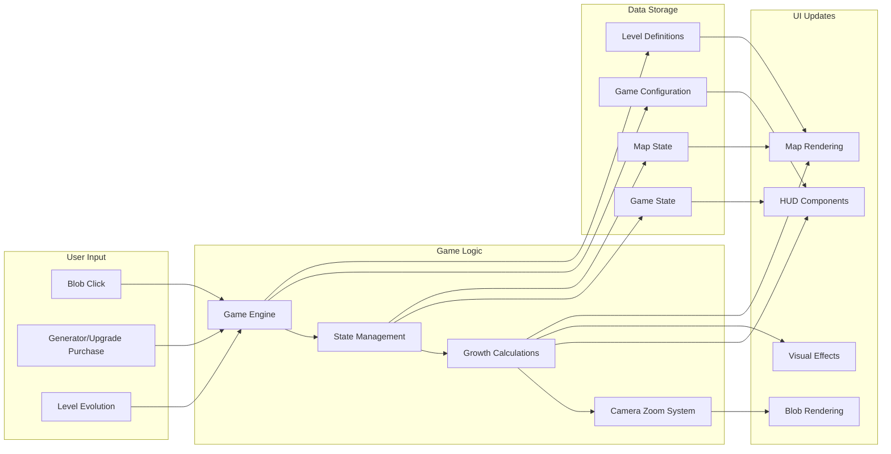

## Camera Zoom System Architecture

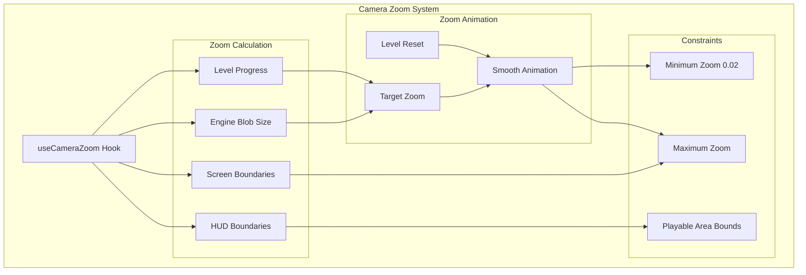

This comprehensive architecture documentation shows the relationships between all major components, user flows, state transitions, and data flow patterns in the blob game, including the updated HUD structure and camera zoom system.
