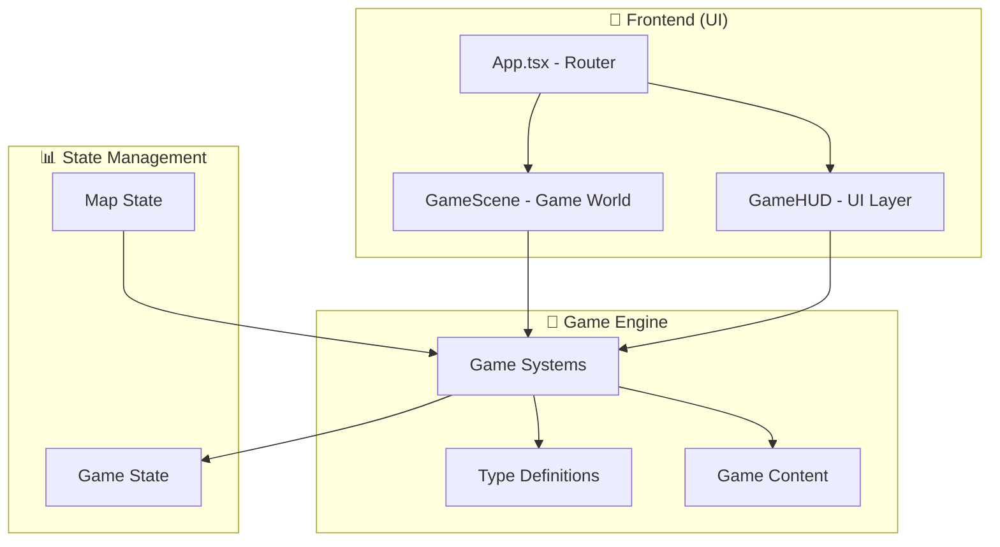
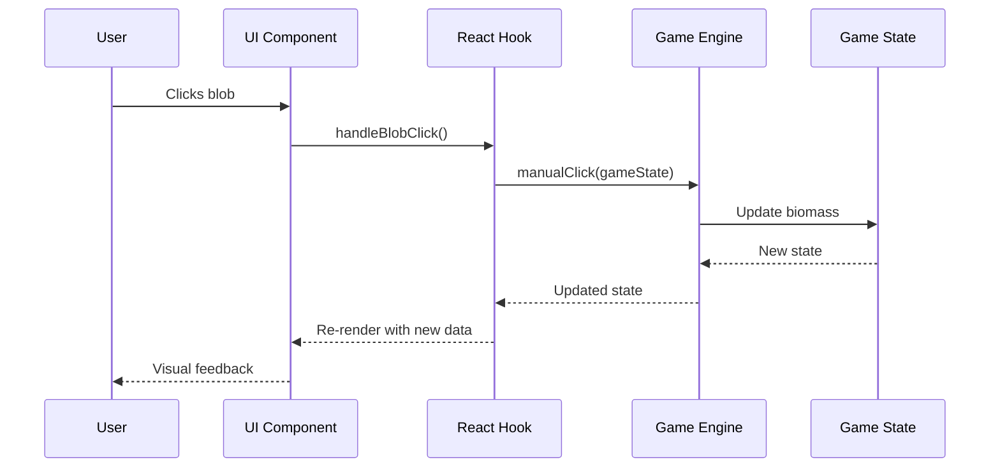
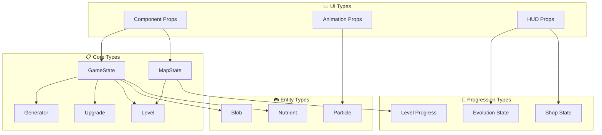

# Blob Game Architecture Guide

A reference for the architecture of blob game, why it's structured this way, and how to add new features while maintaining a clean separation between the game engine (logic) and the frontend (UI).

## File Structure & Architecture

Separation of concerns is important! **Game engine** contains all the logic and state management, acting as the engine and single source of truth. **UI components** only handle presentation, rendering the states and game components in a way that makes it a fun, playable game!

This is like separating the "brain" (engine) from the "face" (UI) of our game. Our noses/ears/mouth don't actually do the smelling/hearing/tasting - they send signals back to the brain where it is processed there with "logic" and "calculations".

```
src/
├── App.tsx                                # 🎯 Main App Router (should be simple and "dumb"!)
├── game/                                  # 🧠 Game Engine (The Brain)
│   ├── types/                                 # Type/interface definitions
│   │   ├── core.ts                                # Core game state types
│   │   ├── progression.ts                         # Levels, progression, economy types
│   │   ├── ui.ts                                  # UI component types
│   │   └── index.ts                               # Re-exports all types from a single location
│   ├── systems/                               # Game logic systems
│   │   ├── actions.ts                             # Game actions (tick, buy, evolve)
│   │   ├── blobSystem.ts                          # Blob-specific logic
│   │   ├── calculations.ts                        # Math and calculations
│   │   ├── generatorValue.ts                      # Shop value calculations
│   │   ├── generatorVisualization.ts              # Generator visualization logic
│   │   ├── initialization.ts                      # Game setup
│   │   ├── mapState.ts                            # Map and level management
│   │   ├── nutrients.ts                           # Food/nutrient logic
│   │   ├── particles.ts                           # Particle system logic
│   │   ├── scaleLevels.ts                         # Evolution scaling
│   │   └── tutorial.ts                            # Tutorial system logic
│   └── content/                               # Game data
│       ├── config.ts                              # Game configuration
│       ├── generators.ts                          # Generator definitions
│       ├── upgrades.ts                            # Upgrade definitions
│       └── levels.ts                              # Level definitions
├── components/                            # 🎨 UI Components (The Face)
│   ├── animations/                            # Visual effects
│   │   └── FloatingNumber.tsx                     # Floating number animations
│   ├── blob/                                  # Blob component
│   │   ├── Blob.tsx                               # Main blob component
│   │   └── BlobContainer.tsx                      # Blob container wrapper
│   ├── generators/                            # Generator system UI
│   │   ├── GeneratorSystem.tsx                    # Main generator system
│   │   ├── GeneratorElement.tsx                   # Individual generator
│   │   └── StackedGeneratorElement.tsx            # Stacked generators
│   ├── particles/                             # Particle system UI
│   │   ├── ParticleSystem.tsx                     # Main particle system
│   │   ├── ParticleSpawner.tsx                    # Particle spawning logic
│   │   └── ParticleRenderer.tsx                   # Particle rendering
│   ├── hud/                                   # Heads-up display
│   │   ├── Evolution/                             # Evolution panel
│   │   │   ├── CurrentLevel.tsx                       # Current level display
│   │   │   ├── EvolutionButton.tsx                    # Evolution button
│   │   │   ├── EvolutionPanel.tsx                     # Main evolution panel
│   │   │   ├── EvolutionScale.tsx                     # Evolution scale display
│   │   │   ├── NextEvolution.tsx                      # Next evolution preview
│   │   │   └── index.ts                               # Evolution exports
│   │   ├── Shop/                                  # Shop interface
│   │   │   ├── BuyMultiplierToggle.tsx                # Buy multiplier toggle
│   │   │   ├── FilterToggle.tsx                       # Filter toggle
│   │   │   ├── Generators.tsx                         # Generators in shop
│   │   │   ├── Shop.tsx                               # Main shop component
│   │   │   ├── Upgrades.tsx                           # Upgrades in shop
│   │   │   ├── ValueScale.tsx                         # Value scale display
│   │   │   └── index.ts                               # Shop exports
│   │   ├── GameHUD.tsx                            # Main HUD component
│   │   └── GameStats.tsx                          # Game statistics
│   ├── map/                                   # Map display
│   │   └── Map.tsx                                # Background map with zoom
│   ├── tutorial/                              # Tutorial UI
│   └── GameScene.tsx                              # Main game scene (all game rendering)
└── hooks/                                 # 🔗 React hooks (The Bridge)
    ├── useGame.ts                             # Main game hook
    ├── useCameraZoom.ts                       # Camera logic
    ├── useBlobSize.ts                         # Blob sizing
    └── useGeneratorAnimation.ts               # Generator animation logic
```

## Architecture Diagrams

### 1. High-Level Architecture



### 2. Data Flow



### 3. UI Component Breakdown

```mermaid
graph TB
    subgraph "🎯 App.tsx Router"
        App[App.tsx]
        App --> GameScene[GameScene]
        App --> HUD[GameHUD]
    end

    subgraph "🎮 GameScene (Game World)"
        GameScene --> Map[Map (background, zoom)]
        GameScene --> Blob[BlobContainer]
        GameScene --> Generators[GeneratorSystem]
        GameScene --> Particles[ParticleSystem]
        GameScene --> Floating[FloatingNumber Animations]
    end

    subgraph "🎮 GameHUD Components"
        HUD --> Stats[GameStats]
        HUD --> Shop[Shop]
        HUD --> Evolution[EvolutionPanel]

        subgraph "🏪 Shop"
            Shop --> Generators[Generators]
            Shop --> Upgrades[Upgrades]
        end

        subgraph "🔄 Evolution"
            Evolution --> CurrentLevel[CurrentLevel]
            Evolution --> NextEvolution[NextEvolution]
            Evolution --> EvolutionButton[EvolutionButton]
        end
    end

    subgraph "🧠 Game Engine"
        GameHook[useGame Hook]
        GameState[Game State]
        Actions[Game Actions]
    end

    Blob --> GameHook
    HUD --> GameHook
    GameHook --> GameState
    GameHook --> Actions
```

### 4. Type System Architecture



### 5. Game Engine Systems

```mermaid
graph TB
    subgraph "🎮 Game Actions"
        Actions[actions.ts]
        Actions --> Tick[tick]
        Actions --> Buy[buyGenerator]
        Actions --> Evolve[evolve]
        Actions --> Click[manualClick]
    end

    subgraph "🧮 Calculations"
        Calc[calculations.ts]
        Calc --> Biomass[calculateBiomass]
        Calc --> Production[calculateProduction]
        Calc --> Costs[calculateCosts]
        Calc --> Scaling[calculateScaling]
    end

    subgraph "🗺️ Map & Progression"
        Map[mapState.ts]
        Map --> LevelChange[changeLevel]
        Map --> MapUpdate[updateMap]

        Scale[scaleLevels.ts]
        Scale --> EvolutionScale[scaleEvolution]
        Scale --> LevelScale[scaleLevel]
    end

    subgraph "🍎 Game Features"
        Nutrients[nutrients.ts]
        Nutrients --> SpawnFood[spawnNutrients]
        Nutrients --> ConsumeFood[consumeNutrients]

        Value[generatorValue.ts]
        Value --> ShopValue[calculateShopValue]
        Value --> UpgradeValue[calculateUpgradeValue]
    end

    subgraph "⚙️ Setup & State"
        Init[initialization.ts]
        Init --> GameInit[initializeGame]
        Init --> StateInit[initializeState]

        GameState[Game State]
        MapState[Map State]
    end

    Actions --> GameState
    Calc --> GameState
    Map --> MapState
    Scale --> GameState
    Nutrients --> GameState
    Value --> GameState
    Init --> GameState
    Init --> MapState
```



## Key Principles

### 1. App.tsx Should Be Dumb

**Ideal State**: App.tsx should be a simple router that:

- Renders the main game container
- Handles basic layout
- Delegates all logic, calculations, and state management to the game engine

**Why This Matters**:

- Makes testing easier (test logic separately from UI)
- Allows UI changes without fundamentally changing/reinventing game logic
- Creates a single source of truth
- Makes the codebase more maintainable and scalable

### 2. Logic Belongs in the Game Engine

**Ideal State**: All game logic should be in the `game/systems/` folder

- Calculations in `calculations.ts`
- Actions in `actions.ts`
- State management in appropriate system files
- Game data and configuration in `game/content/` (generators, upgrades, levels, config)

**Why This Matters**:

- Logic can be tested independently
- Logic can be reused across different UI components
- Easier to debug and maintain
- Clear separation of concerns

### 3. Types Drive Everything

All game state, props, and data structures are defined in `game/types/`. This ensures:

- Type safety across the entire application
- Clear contracts between components
- Better IDE support and error catching
- Self-documenting code

### 4. Domain-Based Component Organization

**New Structure**: Components are organized by domain rather than technical layers:

- `components/blob/` - All blob-related UI
- `components/generators/` - All generator-related UI
- `components/particles/` - All particle-related UI
- `components/map/` - Map background UI
- `components/animations/` - Animation UI components
- `GameScene.tsx` - Main game world container

**Why This Matters**:

- Easier to find related components
- Clear separation of concerns
- No confusion between `src/game` (engine) and `src/components/game` (UI)
- Flat structure is more intuitive

## Adding New Features

### Step 1: Define Types

Add new types to the appropriate file in `game/types/`:

- Core game state → `core.ts`
- UI components → `ui.ts`
- Progression → `progression.ts`

### Step 2: Add Game Logic

Create or update files in `game/systems/`:

- New actions → `actions.ts`
- Calculations → `calculations.ts`
- State management → appropriate system file

### Step 3: Add Content

If your feature needs configuration data, add it to `game/content/`:

- Game config → `config.ts`
- Items/upgrades → `generators.ts` or `upgrades.ts`
- Levels → `levels.ts`

### Step 4: Create UI Components

Build React components in the appropriate `components/` domain folder:

- Blob-related → `components/blob/`
- Generator-related → `components/generators/`
- Particle-related → `components/particles/`
- Animation-related → `components/animations/`
- Map-related → `components/map/`

### Step 5: Connect Everything

Use React hooks to bridge the UI and game engine:

- Main game logic → `useGame.ts`
- Camera logic → `useCameraZoom.ts`
- Blob sizing → `useBlobSize.ts`
- Specialized logic → create new hooks in `hooks/`

## Common Mistakes to Avoid

### ❌ Don't Put Logic in Components

```typescript
// BAD: Logic in component
const MyComponent = () => {
  const calculateSomething = (data) => {
    // Complex calculation here
  };
  return <div>{calculateSomething(data)}</div>;
};
```

### ✅ Put Logic in the Engine

```typescript
// GOOD: Logic in engine
// game/systems/calculations.ts
export const calculateSomething = (data) => {
  // Complex calculation here
};

// Component just uses the logic
const MyComponent = () => {
  const result = calculateSomething(data);
  return <div>{result}</div>;
};
```

### ❌ Don't Make App.tsx Complex

```typescript
// BAD: App.tsx with calculations
const App = () => {
  const complexCalculation = () => {
    /* ... */
  };
  const positioningLogic = () => {
    /* ... */
  };
  return <div>{/* complex JSX */}</div>;
};
```

### ✅ Keep App.tsx Simple

```typescript
// GOOD: App.tsx as router
const App = () => {
  return (
    <div className="game-container">
      <GameScene />
      <GameHUD />
    </div>
  );
};
```

## Testing Strategy

### Engine Testing

Test game logic independently:

```typescript
// Test game actions
describe("buyGenerator", () => {
  it("should increase generator level", () => {
    const state = {
      /* test state */
    };
    const result = buyGenerator(state, "generator-id");
    expect(result.generators["generator-id"].level).toBe(1);
  });
});
```

### Component Testing

Test UI components with mocked game state:

```typescript
// Test component rendering
describe("GameHUD", () => {
  it("should display biomass", () => {
    const mockGameState = { biomass: 100 };
    render(<GameHUD gameState={mockGameState} />);
    expect(screen.getByText("100")).toBeInTheDocument();
  });
});
```

## Conclusion

This architecture provides a solid foundation for a maintainable, scalable game. By keeping logic in the engine and UI in components, we can:

- Test game logic independently
- Reuse logic across different UI contexts
- Make changes without breaking other parts
- Onboard new team members more easily
- Add features more confidently

The new domain-based component organization makes it easier to find and work with related components, while the flat structure eliminates confusion between engine and UI code.

Remember: **The game engine is the brain, the UI is the face. Keep them separate, and everything will work better.**
